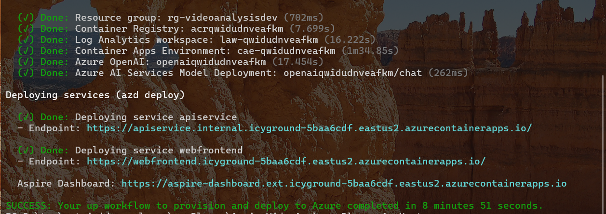
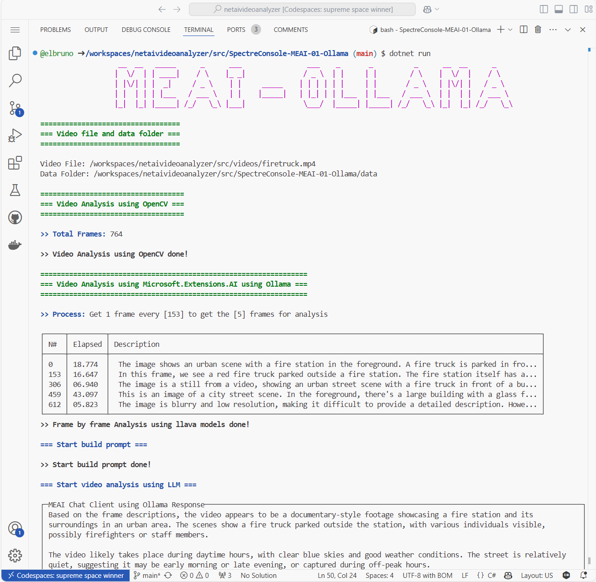

# .NET + AI - Video Analyser

[](https://codespaces.new/Azure-Samples/netaivideoanalyzer)

## Description

[](/LICENSE)
[](https://twitter.com/elbruno)


This repository contains a series of samples on how to analyse a video using multimodal Large Language Models, like GPT-4o or GPT-4o-mini. The repository also includes samples of the use of different AI libraries like:

- [Azure AI OpenAI library for .NET.](https://www.nuget.org/packages/Azure.AI.OpenAI) using **Azure OpenAI Services**
- [Microsoft.Extensions.AI.OpenAI](https://www.nuget.org/packages/Microsoft.Extensions.AI.OpenAI) using **OpenAI APIs**
- [Microsoft.Extensions.AI.AzureAIInference](https://www.nuget.org/packages/Microsoft.Extensions.AI.AzureAIInference) to work with **GitHub Models**
- [Microsoft.Extensions.AI.Ollama](https://www.nuget.org/packages/Microsoft.Extensions.AI.Ollama) to work with **Ollama** local models
- [OpenAI .NET API library](https://www.nuget.org/packages/OpenAI) to work with **OpenAI APIs**.

**Note:** We recommend first going through the [Run Sample Projects](#run-sample-projects) before running this app locally, since some of the demos needs credentials for to work properly.

- [Features](#features)
- [Architecture diagram](#architecture-diagram)
- [Getting started](#getting-started)
- [Deploying to Azure](#deploying)
- [Run Sample Projects](#run-sample-projects)
  - [Video Analysis Sample Projects Overview](#video-analysis-sample-projects-overview)
  - [Run in GitHub CodeSpaces](#run-in-github-codespaces)
  - [Run GitHub Models samples](#run-github-models-samples)
  - [Run OpenAI .NET Library samples](#run-openai-net-library-samples)
  - [Run Azure OpenAI .NET Library samples](#run-azure-openai-net-library-samples)
  - [Run Ollama sample](#run-ollama-sample)
- [Resources](#resources)
- [Video Recordings](#video-recordings)
- [Contributing](#-contributing)
- [Guidance](#guidance)
  - [Costs](#costs)
  - [Security Guidelines](#security-guidelines)
- [Resources](#resources)

## Features

**GitHub CodeSpaces:** This project is designed to be opened in GitHub Codespaces as an easy way for anyone to try out these libraries entirely in the browser.

This is the OpenAI sample running in Codespaces. The sample analyze this video:


And return this output:


There is also a full Aspire solution, including a Blazor FrontEnd application and an API Service to process the video as a reference application to implement this.


## Architecture diagram

COMING SOON!

## Getting Started

The sample Console projects are in the folder [./src/Labs/](./src/Labs/).
The full Aspire + Blazor solution is in the folder [./srcBlazor/](./srcBlazor/).

Currently there are samples for the following technologies:

- [OpenAI .NET SDK](https://devblogs.microsoft.com/dotnet/announcing-the-stable-release-of-the-official-open-ai-library-for-dotnet/)
- [Microsoft AI Extensions](https://devblogs.microsoft.com/dotnet/introducing-microsoft-extensions-ai-preview/)
- [GitHub Models](https://devblogs.microsoft.com/dotnet/using-github-models-and-dotnet-to-build-generative-ai-apps/)
- [Local Image analysis using Ollama](https://ollama.com/blog/vision-models)
- [OpenCV, using OpenCVSharp](https://github.com/shimat/opencvsharp)
- [Phi-3.5](https://aka.ms/Phi-3CookBook)

## Deploying

Once you've opened the project in [Codespaces](#run-in-github-codespaces), or [locally](#run-locally), you can deploy it to Azure.

From a Terminal window, open the folder with the clone of this repo and run the following commands.

1. Login to Azure:

    ```shell
    azd auth login
    ```

2. Provision and deploy all the resources:

    ```shell
    azd up
    ```

    It will prompt you to provide an `azd` environment name (like "videoanalyserdev"), select a subscription from your Azure account, and select a [location where OpenAI is available](https://azure.microsoft.com/explore/global-infrastructure/products-by-region/?products=cognitive-services&regions=all) (like "eastus2").

     Then it will provision the resources in your account and deploy the latest code. If you get an error or timeout with deployment, changing the location can help, as there may be availability constraints for the OpenAI resource.

3. When `azd` has finished deploying, you'll see an endpoint URI in the command output. Visit that URI, and you should see the chat app! 🎉

  

The **[Aspire and Blazor Demo deploy to Azure page](./docs/blazordemo.md)** has more information on how to deploy the solution to Azure and test the project.

## Run sample projects

### Video Analysis Sample Projects Overview

| Library | Project Name | Description |
|--------------|--------------|-------------|
| [OpenAI library for .NET](https://devblogs.microsoft.com/dotnet/announcing-the-stable-release-of-the-official-open-ai-library-for-dotnet/)  | `.\src\ConsoleOpenAI-04-VideoAnalyzer` | Console project  demonstrating the use of the [OpenAI .NET API library](https://www.nuget.org/packages/OpenAI) to work with **OpenAI APIs**. |
| [Azure AI OpenAI library for .NET.](https://www.nuget.org/packages/Azure.AI.OpenAI) | `.\src\ConsoleAOAI-04-VideoAnalyzer` | Console project  demonstrating the use of the stable release of [Azure AI OpenAI library for .NET.](https://www.nuget.org/packages/Azure.AI.OpenAI) using **Azure OpenAI Services** for the video analysis process.|
| [Microsoft.Extensions.AI](https://devblogs.microsoft.com/dotnet/introducing-microsoft-extensions-ai-preview/)  | `.\src\ConsoleMEAI-04-OpenAI` | Console project  demonstrating the use of the [Microsoft.Extensions.AI.OpenAI](https://www.nuget.org/packages/Microsoft.Extensions.AI.OpenAI) using **OpenAI APIs** for the video analysis process. |
| [Microsoft.Extensions.AI](https://devblogs.microsoft.com/dotnet/introducing-microsoft-extensions-ai-preview/)  | `.\src\ConsoleMEAI-05-GitHubModels` | Console project  demonstrating the use of the [Microsoft.Extensions.AI.AzureAIInference](https://www.nuget.org/packages/Microsoft.Extensions.AI.AzureAIInference) to work with **GitHub Models** |
| [Microsoft.Extensions.AI](https://devblogs.microsoft.com/dotnet/introducing-microsoft-extensions-ai-preview/)  | `.\src\ConsoleMEAI-06-Ollama` | Console project  demonstrating the use of the [Microsoft.Extensions.AI.Ollama](https://www.nuget.org/packages/Microsoft.Extensions.AI.Ollama) to work with **Ollama** local models. This sample uses [Llava 7B](https://ollama.com/library/llava) for image analysis and [Phi 3.5](https://ollama.com/library/phi3.5) for Chat completion |
| [Microsoft.Extensions.AI](https://devblogs.microsoft.com/dotnet/introducing-microsoft-extensions-ai-preview/)  | `.\src\ConsoleMEAI-07-AOAI` | Console project  demonstrating the use of the [Microsoft.Extensions.AI.AzureAIInference](https://www.nuget.org/packages/Microsoft.Extensions.AI.AzureAIInference) to work with **Azure OpenAI Services** |
| [Aspire + Blazor Complete Demo](./docs/blazordemo.md))  | `.\srcBlazor\AspireVideoAnalyserBlazor.sln` | Aspire Project with a frontEnd in Blazor and an API service to analyze videos. Work with **GitHub Models** by default, or **Azure OpenAI Services** with Default Credentials or an API Key.  |

### Run in GitHub CodeSpaces

1. Create a **GitHub Personal Token Access** to be used on the GH Models samples. [Get your GitHub Personal Access Token](https://github.com/settings/tokens).

1. Create a new  Codespace using the `Code` button at the top of the repository.


1. The Codespace createion process can take a couple of minutes.

1. Once the Codespace is loaded, it should have all the necessary requirements to run the demo projects.

### Run Locally

To run the project locally, you'll need to make sure the following tools are installed:

- [.NET 8](https://dotnet.microsoft.com/downloads/)
- [Git](https://git-scm.com/downloads)
- [Azure Developer CLI (azd)](https://aka.ms/install-azd)
- [VS Code](https://code.visualstudio.com/Download) or [Visual Studio](https://visualstudio.microsoft.com/downloads/)
  - If using VS Code, install the [C# Dev Kit](https://marketplace.visualstudio.com/items?itemName=ms-dotnettools.csdevkit)

To run the Aspire and Blazor sample, you also need **.NET Aspire**.

- .NET Aspire workload:
Installed with the [Visual Studio installer](https://learn.microsoft.com/en-us/dotnet/aspire/fundamentals/setup-tooling?tabs=windows&pivots=visual-studio#install-net-aspire) or the [.NET CLI workload](https://learn.microsoft.com/en-us/dotnet/aspire/fundamentals/setup-tooling?tabs=windows&pivots=visual-studio#install-net-aspire).
- An OCI compliant container runtime, such as:
  * [Docker Desktop](https://www.docker.com/products/docker-desktop/) or [Podman](https://podman.io/).

### Run GitHub Models samples

To run the sample using GitHub Models, located in `./src/ConsoleMEAI-05-GitHubModels`.

Once you got your PAT, follow this steps.

- Navigate to the sample project folder using the command:

```bash
cd ./src/ConsoleMEAI-05-GitHubModels/
```

- Run the project:

```bash
dotnet run
```

- You can expect an output similar to this one:


### Run OpenAI .NET Library samples

To run the sample using OpenAI APIs, located in `./src/ConsoleOpenAI-04-VideoAnalyzer`, you must set your OpenAI Key in a user secret.

- Navigate to the sample project folder using the command:

```bash
cd ./src/ConsoleOpenAI-04-VideoAnalyzer/
```

- Add the user secrets running the command:

```bash
dotnet user-secrets init
dotnet user-secrets set "OPENAI_KEY" "< your key goes here >"
```

- Run the project:

```bash
dotnet run
```

- You can expect an output similar to this one:


### Run Azure OpenAI .NET Library samples

To run the sample using Azure OpenAI Services, located in `./src/ConsoleAOAI-04-VideoAnalyzer`, you must set your Azure OpenAI keys in a user secret.

- Navigate to the sample project folder using the command:

```bash
cd ./src/ConsoleAOAI-04-VideoAnalyzer/
```

- Add the user secrets running the command:

```bash
dotnet user-secrets init
dotnet user-secrets set "AZURE_OPENAI_MODEL" "gpt-4o"
dotnet user-secrets set "AZURE_OPENAI_ENDPOINT" "https://< your service endpoint >.openai.azure.com/"
dotnet user-secrets set "< your key goes here >" 
```

- Run the project with the command:

```bash
dotnet run
```

- You can expect an output similar to this one:


### Run Ollama sample

- Follow the instructions in the [Run Ollama Sample](./docs/runollamademo.md)

- You can expect an output similar to this one:



## Guidance

### Costs

**GitHub Models** offers a set of models that can be used to test this projects. This free API usage are rate limited by requests per minute, requests per day, tokens per request, and concurrent requests. If you get rate limited, you will need to wait for the rate limit that you hit to reset before you can make more requests.

More Information: [GitHub Models Rate Limits](https://docs.github.com/en/github-models/prototyping-with-ai-models#rate-limits)

For **Azure OpenAI Services**, pricing varies per region and usage, so it isn't possible to predict exact costs for your usage.
The majority of the Azure resources used in this infrastructure are on usage-based pricing tiers.
However, Azure Container Registry has a fixed cost per registry per day.

You can try the [Azure pricing calculator](https://azure.com/e/2176802ea14941e4959eae8ad335aeb5) for the resources:

* Azure OpenAI Service: S0 tier, gpt-4o-mini model. Pricing is based on token count. [Pricing](https://azure.microsoft.com/pricing/details/cognitive-services/openai-service/)
* Azure Container App: Consumption tier with 0.5 CPU, 1GiB memory/storage. Pricing is based on resource allocation, and each month allows for a certain amount of free usage. [Pricing](https://azure.microsoft.com/pricing/details/container-apps/)
* Azure Container Registry: Basic tier. [Pricing](https://azure.microsoft.com/pricing/details/container-registry/)
* Log analytics: Pay-as-you-go tier. Costs based on data ingested. [Pricing](https://azure.microsoft.com/pricing/details/monitor/)

⚠️ To avoid unnecessary costs, remember to take down your app if it's no longer in use,
either by deleting the resource group in the Portal or running `azd down`.

### Security Guidelines

Samples in this templates uses Azure OpenAI Services with ApiKey and [Managed Identity](https://learn.microsoft.com/entra/identity/managed-identities-azure-resources/overview) for authenticating to the Azure OpenAI service.

The [Aspire + Blazor sample](./docs/blazordemo.md) uses Managed Identity](https://learn.microsoft.com/entra/identity/managed-identities-azure-resources/overview) for authenticating to the Azure OpenAI service.

Additionally, we have added a [GitHub Action](https://github.com/microsoft/security-devops-action) that scans the infrastructure-as-code files and generates a report containing any detected issues. To ensure continued best practices in your own repository, we recommend that anyone creating solutions based on our templates ensure that the [Github secret scanning](https://docs.github.com/code-security/secret-scanning/about-secret-scanning) setting is enabled.

You may want to consider additional security measures, such as:

* Protecting the Azure Container Apps instance with a [firewall](https://learn.microsoft.com/azure/container-apps/waf-app-gateway) and/or [Virtual Network](https://learn.microsoft.com/azure/container-apps/networking?tabs=workload-profiles-env%2Cazure-cli).


## Resources

### Video Recordings

[](https://www.youtube.com/live/vQr5N2E_6AM?si=Kmtq0QGNVp4OgFMZ)
