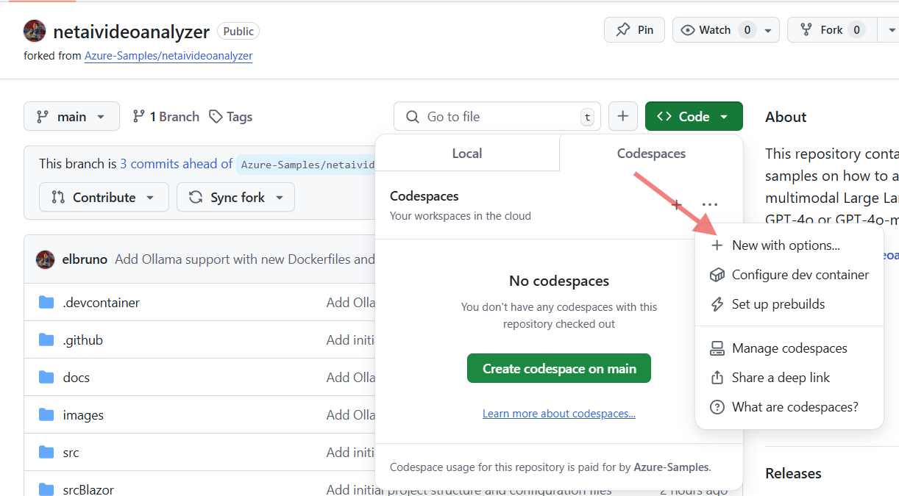
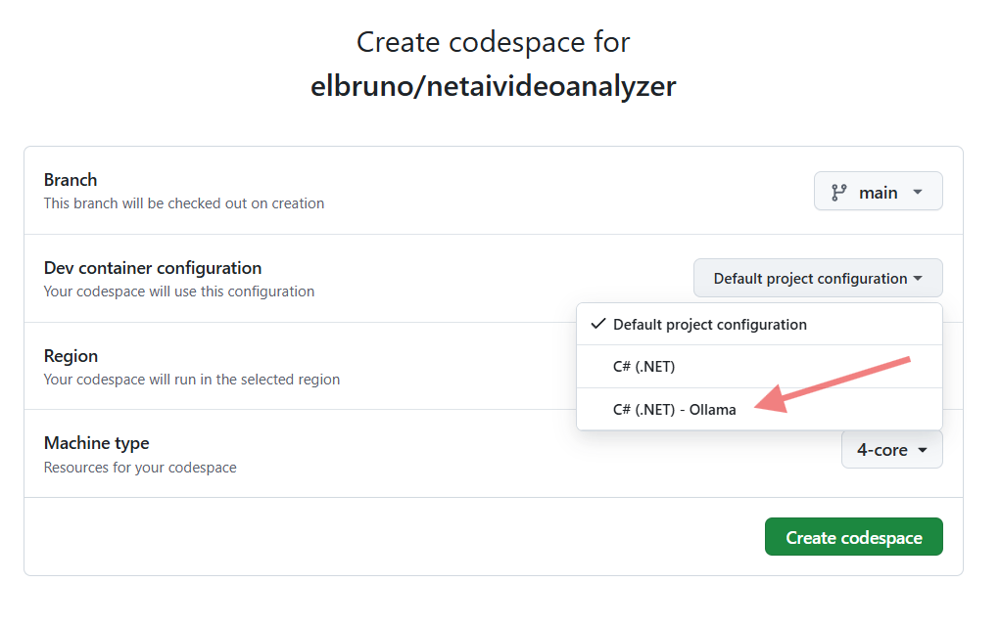
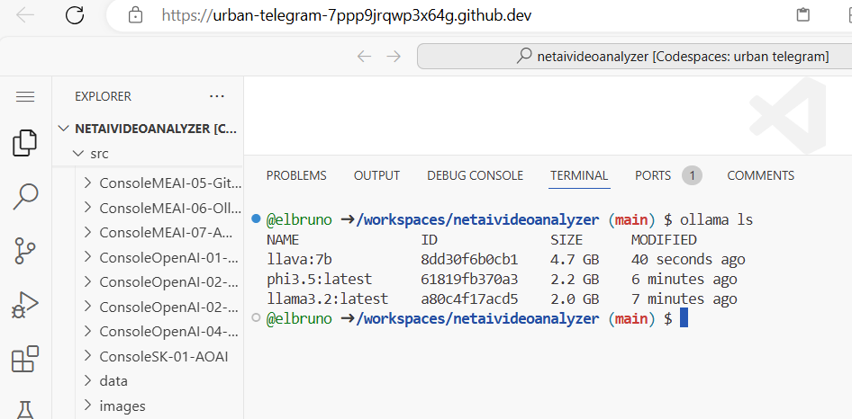

# Run sample using Ollama and local models

## Create a Codespace

- Create a new Codespace using the option **New with options**:

    

- Select the Ollama template for the Codespace

    

- Create the Codespace.

- The process could take a couple of minutes.

## Download Models from Ollama

Once the Codespace is created open a terminal and download the following models from Ollama

- [llava](https://ollama.com/library/llava)

- [llama3.2](https://ollama.com/library/llama3.2)

- [phi3.5](https://ollama.com/library/phi3.5)

Download the models, run the commands

```bash
ollama pull llava:7b
ollama pull llama3.2
ollama pull phi3.5
```

Check the downloaded models with the command:

```bash
ollama ls
```

The output should be similar to this one:


## Run the Spectre Console demo

- Navigate to the sample project folder using the command:

```bash
cd cd ./src/SpectreConsole-MEAI-01-Ollama/
```

- Run the project:

```bash
dotnet run
```

- You can expect an output similar to this one:


## Update the demo to use Phi-3.5

- Edit the file `./src/SpectreConsole-MEAI-01-Ollama/Program.cs`

- Change the model name to `phi3.5`

- Increment the number of frames to be processed to get a more detailed analysis.

    ```csharp
    //////////////////////////////////////////////////////
    /// Microsoft.Extensions.AI using Ollama
    //////////////////////////////////////////////////////
    SpectreConsoleOutput.DisplayTitleH1("Video Analysis using Microsoft.Extensions.AI using Ollama");
    
    IChatClient chatClientImageAnalyzer =
        new OllamaChatClient(new Uri("http://localhost:11434/"), "llava:7b");
    IChatClient chatClient =
        new OllamaChatClient(new Uri("http://localhost:11434/"), "phi3.5");
    
    // for the ollama process we use only 5 frames
    // change this value to get more frames for a more detailed analysis
    var numberOfFrames = 10; //PromptsHelper.NumberOfFrames;
    
    List<string> imageAnalysisResponses = new();
    int step = (int)Math.Ceiling((double)frames.Count / numberOfFrames);
    ```

- Run the project again.
